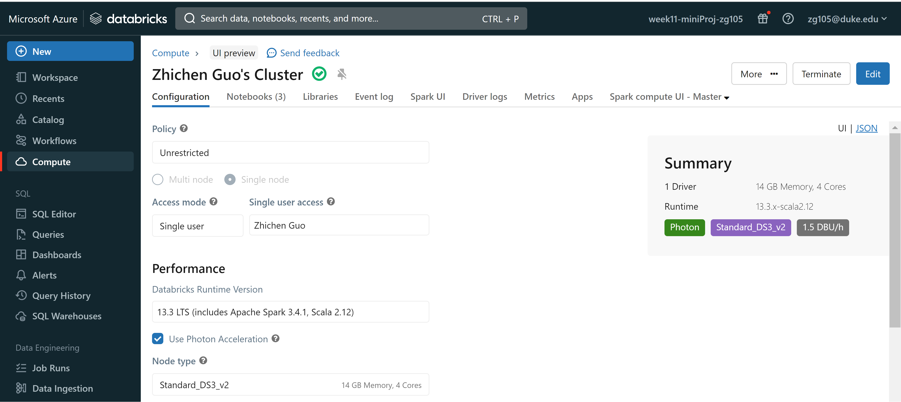
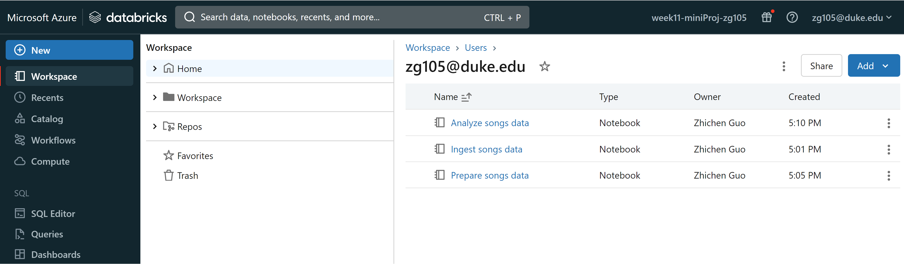
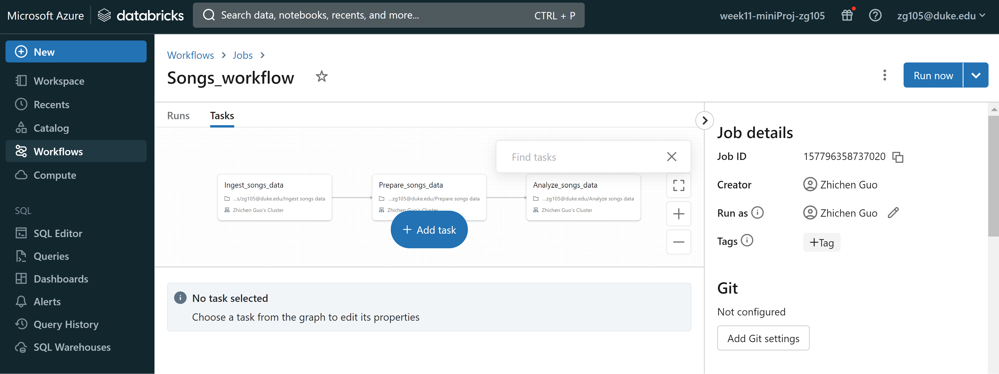
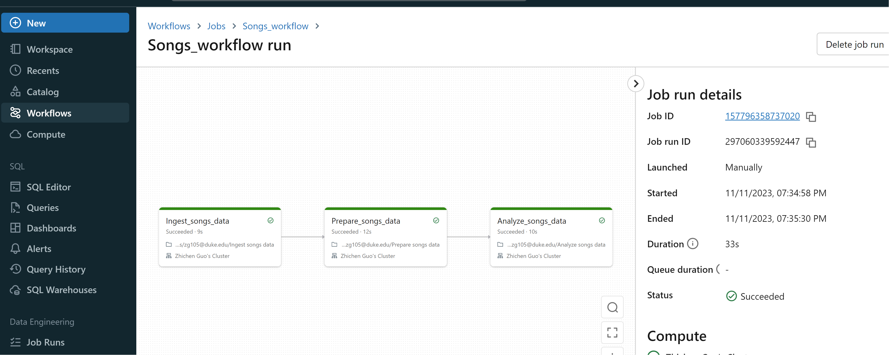

# Week11-miniProj-zg105

In this project, I get started building data pipelines on Databricks, this includes:

 - Use Databricks features to explore a raw dataset.

 - Create a Databricks notebook to ingest raw source data and write the raw data to a target table.

 - Create a Databricks notebook to transform the raw source data and write the transformed data to a target table.

 - Create a Databricks notebook to query the transformed data.

 - Automate the data pipeline with a Databricks job.

## Prerequisites

- build a new databricks workspace

## Steps

1. **Create a cluster**: Create a cluster for computing

2. **Create notebooks**: Create 3 notebooks to realize data ingestion, prepare and analyze.

3. **Build a pipeline**: Create a pipeline and add my tasks.

4. **Run**: Click runall to see the result.

